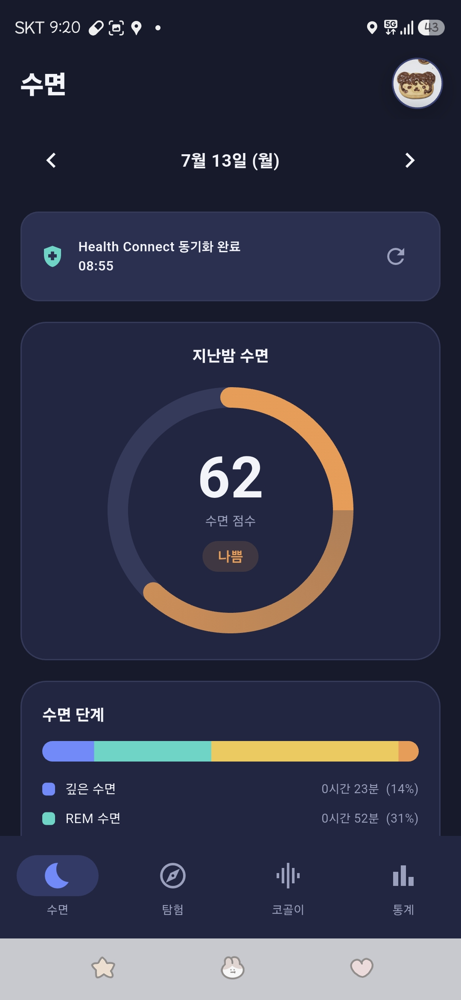
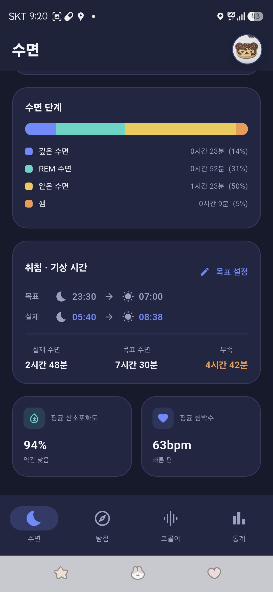
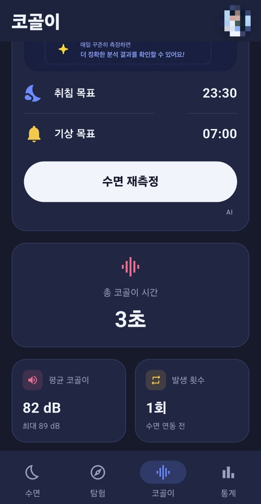
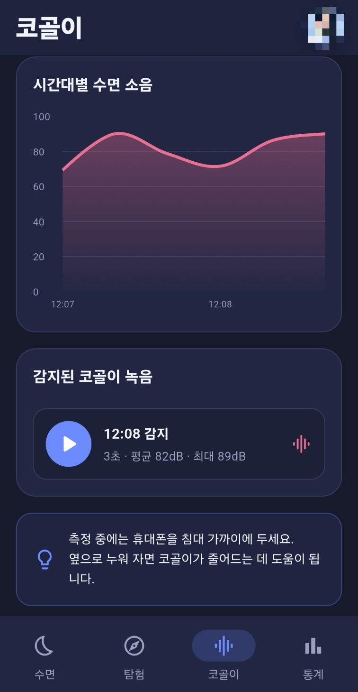
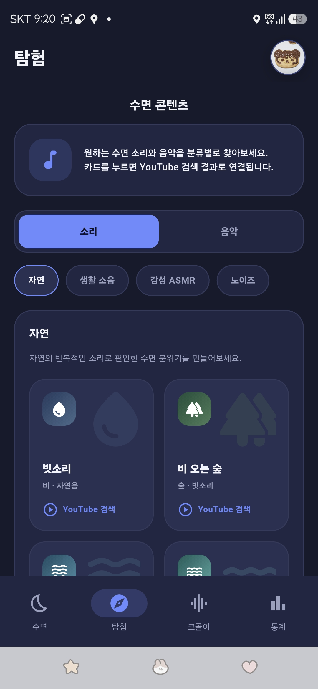
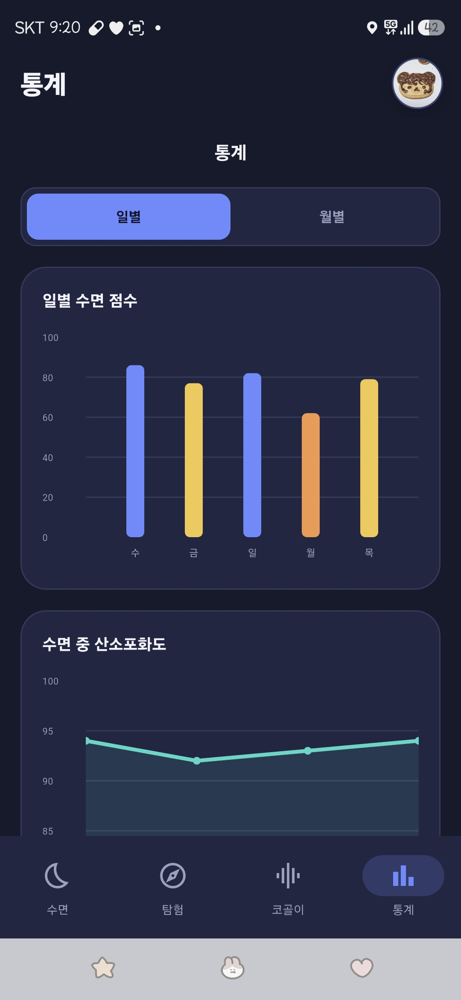
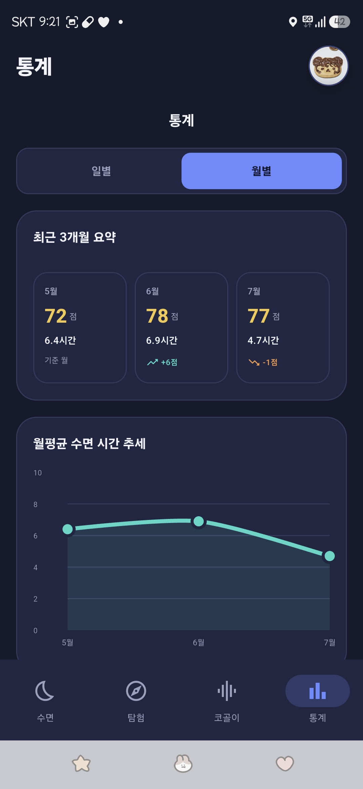
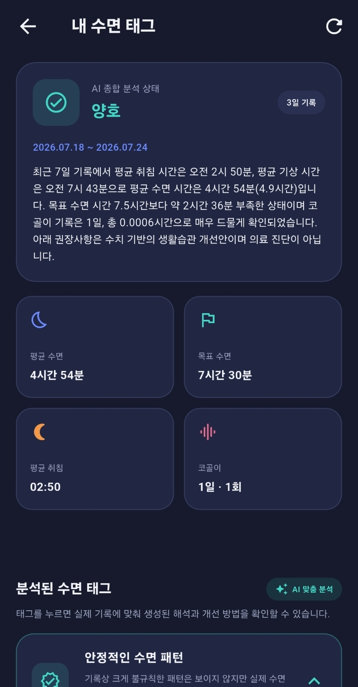

# ZZcare

수면과 코골이를 자동으로 기록하고 분석해주는 수면 헬스케어 서비스입니다.

Health Connect에서 가져온 실제 수면 데이터와, AI 모델이 자동으로 감지·분류한 코골이 데이터를 결합해서 사용자에게 매일 밤의 수면 리포트를 제공합니다.

---

## 서비스가 하는 일

1. **수면 기록**: Android Health Connect(삼성 헬스 등)와 연동해서 취침/기상 시각, 수면 단계(깊은잠·REM·얕은잠·깸)를 자동으로 가져옵니다.
2. **워치 기반 생체 데이터**: Health Connect를 통해 산소포화도(SpO2), 호흡수, 심박수 데이터를 함께 가져와 수면 중 상태를 참고용으로 보여줍니다.
3. **코골이 자동 감지**: 수면 중 마이크로 5초 단위 오디오를 수집하고, AI 모델이 이를 1초 단위 5개로 나눠 각각 판별한 뒤 투표(voting) 방식으로 최종 코골이 여부를 결정합니다.
   - 기본 기준: 5개 중 3개 이상이 코골이로 판별되면 해당 5초 구간을 코골이로 인정
   - 측정이 끝나면 코골이로 판별된 구간 중 최대 dB 기준 TOP 5만 선별해 저장
   - 이 결과로 코골이 시간, 강도(dB), 발생 횟수, 시간대별 패턴을 자동으로 산출합니다.
4. **실시간 코골이 알림**: 측정 도중에도 5초 조각이 준비될 때마다 즉시 AI 판별을 실행해서, 코골이가 감지되면 폰/워치로 진동 알림을 보냅니다. (쿨다운 적용으로 과도한 알림 방지)
5. **리포트 제공**: 수면·생체 데이터와 코골이 데이터를 하루 단위로 합쳐서 수면 점수, 수면 단계, 코골이 통계, 일별/월별 추이를 사용자에게 보여줍니다.
6. **로그인/계정 관리**: 카카오 로그인으로 간편하게 가입하고, 서버에 사용자 데이터를 저장해 기록을 이어갈 수 있습니다.

즉, "**사용자가 직접 아무것도 입력하지 않아도, 자는 동안 자동으로 수면과 코골이가 기록되는 것**"이 이 서비스의 핵심입니다.

---

## 화면구성

### 📱 수면

| 지난밤 수면 요약 | 수면 단계 · 생체 데이터 |
|---|---|
|  |  |

취침 시각, 수면 점수, 수면 단계(깊은잠/REM/얕은잠/깸) 비율과 평균 산소포화도·심박수를 한눈에 확인할 수 있습니다.

### 🔊 코골이

| 시간대별 소음 · 감지 녹음 | 총 코골이 통계 |
|---|---|
|  |  |

총 코골이 시간, 평균/최대 dB, 발생 횟수, 시간대별 강도, 감지된 코골이 녹음 재생 기능을 제공합니다.

### 🌙 탐험

| 수면 소리/음악 탐색 |
|---|
|  |

카테고리별(자연, 생활 소음, 감성 ASMR, 노이즈)로 수면에 도움이 되는 소리를 찾아볼 수 있고, 카드를 누르면 YouTube 검색 결과로 연결됩니다.

### 📊 통계

| 일별 통계 | 월별 통계 |
|---|---|
|  |  |

일별 수면 점수, 산소포화도 추이와 최근 3개월 요약, 월평균 수면 시간 추세를 확인할 수 있습니다.

### 🏷️ 수면 태그 분석

| AI 종합 분석 |
|---|
|  |

최근 기록을 기반으로 AI가 취침·기상 패턴, 코골이 발생 빈도 등을 종합 분석해 생활습관 개선 코멘트를 제공합니다. (의료 진단이 아닌 참고용입니다.)

---

## 전체 구성

서비스는 크게 세 부분으로 이루어져 있습니다.

### 📱 모바일 앱 (Flutter)

사용자가 실제로 사용하는 화면입니다. 수면 / 탐험 / 코골이 / 통계 4개 탭으로 구성되어 있고, Health Connect 동기화와 AI 코골이 측정을 실행하는 클라이언트 역할을 합니다.

- **수면 탭**: 지난밤 수면 점수, 수면 단계 비율, 취침·기상 시각, 목표 대비 부족 수면, 평균 산소포화도·심박수
- **탐험 탭**: 수면에 도움이 되는 소리·음악을 카테고리별(자연, 생활 소음, 감성 ASMR, 노이즈 등)로 탐색. 테마 카드를 누르면 해당 음원의 YouTube 검색 결과로 연결됨
- **코골이 탭**: 총 코골이 시간, 평균/최대 dB, 발생 횟수, 시간대별 강도 그래프, 감지된 코골이 녹음 재생
- **통계 탭**: 일별/월별 추이를 수면 점수·수면 시간·소음·부족 수면 기준으로 차트화

### 🧠 AI 코골이 분류 모델

마이크로 수집한 오디오를 분석해서 코골이 여부를 자동으로 판별하는 모델입니다.

- 5초 단위로 녹음된 오디오를 1초 단위 5개 구간으로 나눠 각각 코골이 확률을 추론
- 5개 중 일정 개수(기본 3개) 이상이 코골이로 판별되면 해당 5초 구간 전체를 코골이로 최종 판정하는 투표(voting) 방식 사용
- 이 판별 결과가 코골이 시간·dB·발생 횟수 등 정량적인 지표로 변환되어 앱에 표시됨
- 추론은 서버(FastAPI) 측에서 수행되며, 앱은 오디오 파일만 서버로 전송

### ☁️ 백엔드 (FastAPI + MongoDB Atlas)

- 카카오 로그인 정보를 받아 사용자 계정을 저장/조회
- 코골이 판별을 위한 AI 추론 엔드포인트(`/predict`) 제공
- 사용자별 수면 기록 관리의 기반이 되는 서버
- 데이터베이스는 MongoDB Atlas(클라우드)를 사용해, 로컬 서버 환경과 무관하게 데이터가 상시 유지됨
- 개발 환경에서는 Cloudflare Tunnel을 통해 로컬에서 실행 중인 백엔드 서버를 외부(모바일 앱)에서 접근 가능한 주소로 노출

### 🔧 배포 / 인프라

- **Docker**: 백엔드(FastAPI)는 `Dockerfile`로 컨테이너화되어 있고, `docker-compose.yml`로 실행을 관리합니다.
- **Jenkins**: `Jenkinsfile`을 통해 빌드/배포 파이프라인이 구성되어 있습니다.
- 데이터베이스는 로컬 컨테이너가 아닌 MongoDB Atlas(클라우드)를 사용하므로, 백엔드 컨테이너만 재시작해도 데이터가 유지됩니다.

---

## 설계 원칙

- **목업 데이터 없음**: 화면에 보이는 모든 값은 Health Connect 또는 AI 코골이 측정에서 나온 실제 데이터입니다.
- **실패해도 안 막히는 화면**: 데이터를 못 가져와도 앱은 정상적으로 뜨고 0(또는 안내 문구)으로 표시되며, 상단 배너나 카드 내 문구로 조용히 상태를 안내합니다.
- **수면 점수는 룰 기반 계산**: 목표 대비 수면시간 차이, 깊은잠/REM 비율, 깨어있던 비율을 기준으로 100점에서 감점하는 방식입니다. 의학적으로 검증된 공식이 아니라 서비스용 휴리스틱입니다.
- **날짜 중복 방지**: 하루에 여러 수면 세션(낮잠 + 밤잠 등)이 감지되면, 가장 긴 세션만 그날의 대표 수면 기록으로 사용합니다.

---

## 기술 스택

| 영역             | 내용                                                 |
| ---------------- | ---------------------------------------------------- |
| 모바일 앱        | Flutter (Dart)                                       |
| 수면 데이터 연동 | `health` 패키지 (Android Health Connect)             |
| 생체 데이터      | 산소포화도(SpO2), 호흡수, 심박수 (Health Connect)    |
| 코골이 분석      | AI 오디오 분류 모델 (1초 단위 투표 기반 코골이 판별) |
| 실시간 알림      | `flutter_local_notifications`, `vibration`           |
| 차트/시각화      | `fl_chart`                                           |
| 로그인           | 카카오 로그인 SDK                                    |
| 백엔드           | FastAPI                                              |
| 데이터베이스     | MongoDB Atlas (클라우드)                             |
| 개발 환경 터널링 | Cloudflare Tunnel                                    |
| 컨테이너화       | Docker, Docker Compose                               |
| CI/CD            | Jenkins                                              |

---

## 프로젝트 구조

```
No_snoring_Great_sleeping/
│
├──backend
│   ├── app
│   │	├── __init__.py
│   │	├── config.py
│   │	├── database.py
│   │	├── feature.py
│   │	├── main.py
│   │	├── model_service.py
│   │	├── realtime_manager.py
│   │	└── snore_detector.py
│   ├── models
│   ├── uploads
│   ├── .dockerignore
│   ├── .env
│   ├── .env.example
│   ├── Dockerfile
│   └── requirements.txt
├──frontend
│   ├── android
│   │	├── app
│   │	│    ├──src
│   │	│    ├──build
│   │	│    ├──gradle
│   │	│    ├──.gitignore
│   │	│    ├──build.gradle.kts
│   │	│    ├──gradle.properties
│   │	│    └──settings.gradle.kts
│   ├── assets
│   ├── lib
│   │	├──models
│   │	│    ├──sleep_data.dart
│   │	│    └──sleep_tag_result.dart
│   │	├──screens
│   │	│    ├──app_info_screen.dart
│   │	│    ├──explore_screen.dart
│   │	│    ├──home_screen.dart
│   │	│    ├──login_screen.dart
│   │	│    ├──sleep_report_preview_screen.dart
│   │	│    ├──sleep_tab.dart
│   │	│    ├──sleep_tag_screen.dart
│   │	│    ├──snoring_tab.dart
│   │	│    ├──splash_screen.dart
│   │	│    └──stats_tab.dart
│   │	├──services
│   │	│    ├──api_server_manager.dart
│   │	│    ├──auth_api_service.dart
│   │	│    ├──health_connect_service.dart
│   │	│    ├──kakao_auth_service.dart
│   │	│    ├──sleep_llm_service.dart
│   │	│    ├──sleep_report_pdf_service.dart
│   │	│    ├──sleep_tag_analysis_service.dart
│   │	│    ├──snore_classification_service.dart
│   │	│    ├──snore_history_service.dart
│   │	│    ├──snore_measure_service.dart
│   │	│    ├──snore_notification_service.dart
│   │	│    ├──snore_polling_service.dart
│   │	│    └──snore_realtime_service.dart
│   │	├──state
│   │	│    └──app_state.dart
│   │	├──widgets
│   │	│    ├──circular_score.dart
│   │	│    ├──common.dart
│   │	│    └──kakao_profile_sheet.dart
│   │	├──config.dart
│   │	├──main.dart
│   │	└──theme.dart
│   ├── public
│   ├── web
│   ├── .gitignore
│   ├── .metadata
│   ├── analysis_options.yaml
│   ├── pubspec.lock
│   └── pubspec.yaml
├──models (모델 파일 백업 폴더)
├──tools
│   └── cloudflares.exe
├──.gitignore
├──docker-compose.yml
├──Jenkinsfile
└──README.md
```

---

## 시작하기

### 백엔드 (FastAPI)

```bash
cd backend
python -m venv venv
source venv/Scripts/activate  # Windows Git Bash

pip install -r requirements.txt

cp .env.example .env
# .env 파일을 열어 아래 값을 실제 값으로 채워주세요
```

`.env` 예시:

```dotenv
MONGO_URI=mongodb+srv://<username>:<password>@<cluster-url>/?appName=Cluster0
MONGO_DB=zzcare_db
```

> ⚠️ 실제 계정 정보(`<username>`, `<password>`, `<cluster-url>`)는 절대 커밋하지 마세요. `.env`는 반드시 `.gitignore`에 포함되어야 합니다.

서버 실행:

```bash
uvicorn app.main:app --reload --host 0.0.0.0 --port 8000
```

실행 후 `http://localhost:8000/docs`에서 Swagger UI로 API 스펙을 확인할 수 있습니다.

### 프론트엔드 (Flutter)

```bash
cd frontend
flutter pub get
flutter run
```

- `lib/config.dart`에서 백엔드 API 주소(Cloudflare Tunnel URL 또는 로컬 주소)를 확인/수정하세요.
- Health Connect 연동을 위해 실제 Android 기기 또는 Health Connect가 설치된 에뮬레이터가 필요합니다.
- 카카오 로그인 테스트를 위해 카카오 개발자 콘솔에 등록된 키 값이 설정 파일에 있어야 합니다.

### Docker로 백엔드 실행 (선택)

```bash
docker-compose up --build
```

---

## 유의사항

본 서비스는 수면 습관 개선을 돕기 위한 참고용 애플리케이션이며, 의학적 진단이나 치료를 대체하지 않습니다. 앱에서 제공하는 수면 점수, 산소포화도·심박수·호흡수 관련 안내, 코골이 분석 결과는 모두 참고 자료일 뿐 의학적으로 검증된 지표가 아닙니다.

수면 무호흡증, 심혈관 질환 등 건강상 우려가 있으신 경우 반드시 전문 의료진과 상담하시기 바랍니다. 본 서비스의 이용으로 발생하는 건강상의 판단이나 결과에 대해 개발자는 책임을 지지 않습니다.
